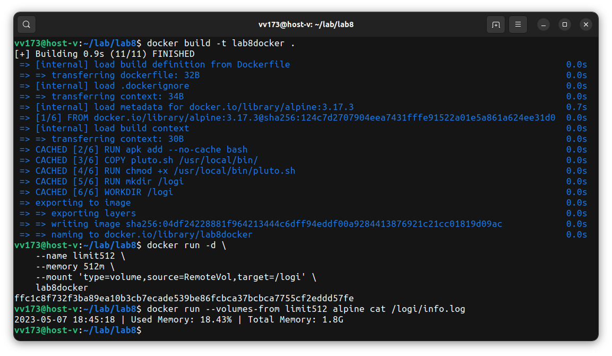
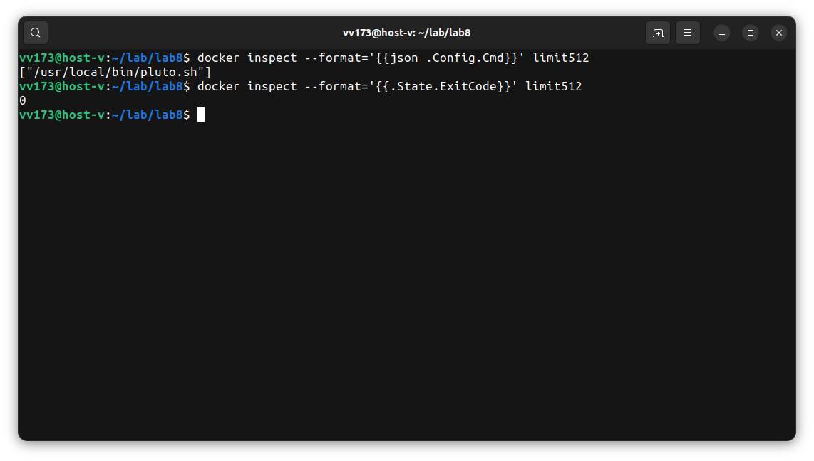
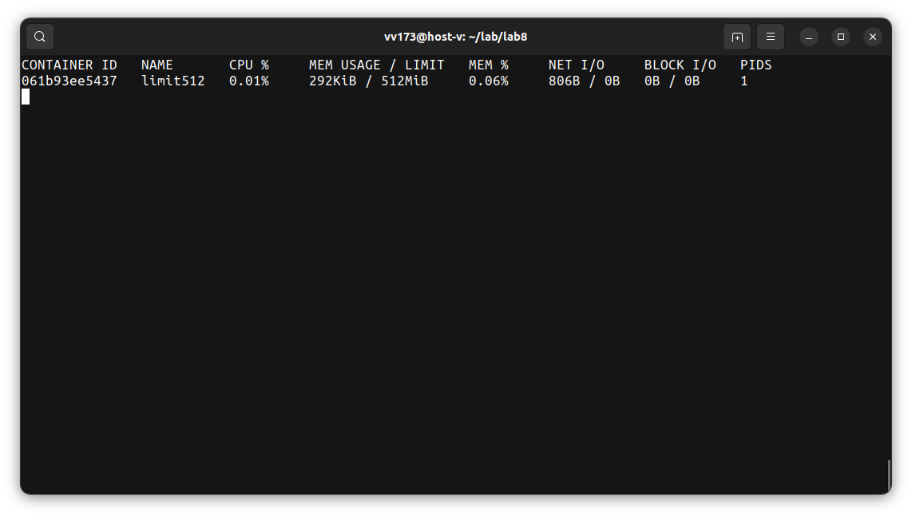
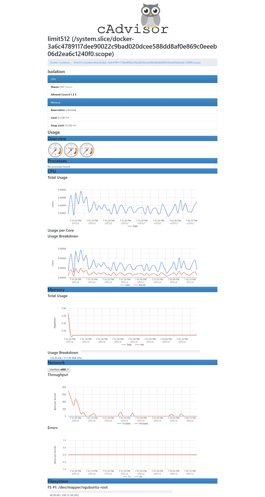

Build:

```
docker build -t lab8docker .
```

Run:

```
docker run -d \
    --name limit512 \
    --memory 512m \
    --mount 'type=volume,source=RemoteVol,target=/logi' \
    lab8docker
```

Check that the pluto.sh script generates the required data and places it in the info.log file on the volume, which is located on the file system on the host machine:

```
docker run --volumes-from limit512 alpine cat /logi/info.log
```



```
docker inspect --format='{{json .Config.Cmd}}' limit512
docker inspect --format='{{.State.ExitCode}}' limit512
```



Check docker container memory limit:

```
docker run -d \
    --name limit512 \
    --memory 512m \
    --mount 'type=volume,source=RemoteVol,target=/logi' \
    lab8docker tail -f /dev/null; docker stats
```



Running cAdvisor in a Docker Container

```
VERSION=v0.46.0 # use the latest release version from https://github.com/google/cadvisor/releases
sudo docker run \
  --volume=/:/rootfs:ro \
  --volume=/var/run:/var/run:ro \
  --volume=/sys:/sys:ro \
  --volume=/var/lib/docker/:/var/lib/docker:ro \
  --volume=/dev/disk/:/dev/disk:ro \
  --publish=8080:8080 \
  --detach=true \
  --name=cadvisor \
  --privileged \
  --device=/dev/kmsg \
  gcr.io/cadvisor/cadvisor:$VERSION
```

Docker container resources usage in cAdvisor:

